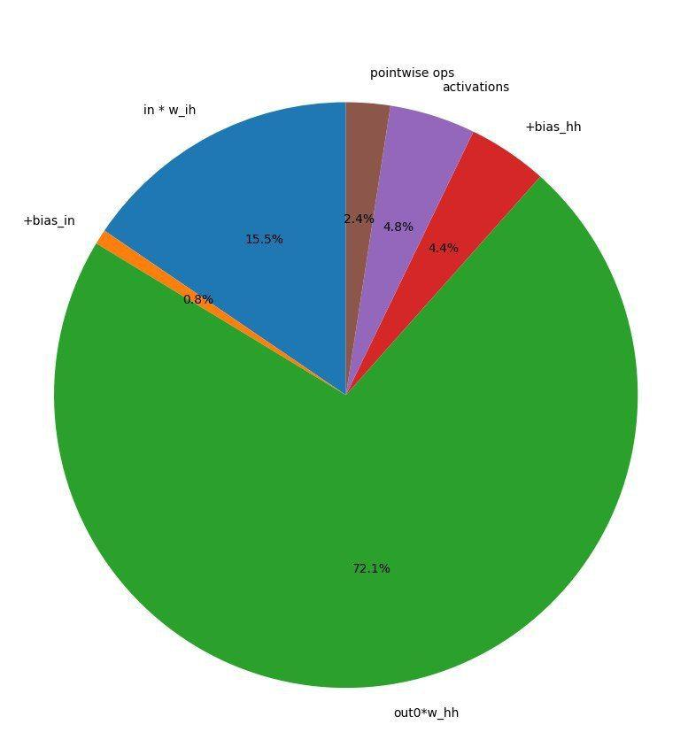

# Ускорение инференс-прохода под андроид

### Результаты ускорений на CPU
Была включена оптимизация кода O3 (путём модификации .ninja билд скриптов,
сгенерированных Android-studio). Также вручную была включена поддержка
сопроцессора `neon`.  
To что оптимизация o3 вклюлилась стало понятно сразу, потому что производительность
матричной операции `gemm` увеличилась в 10 раз. Однако то, что вклюлился сопроцессор
`neon` было неочевидно. Поэтому мы потратили 2 недели на написание всех необходимых
`SIMD` операций вручную. Мы применили библиотеку
[nsimd](https://github.com/agenium-scale/nsimd) вручную написали операции матричного
умножения. Сравнили производительность с вариантом матричного умножения без
оптимизации $О(N^3)$ и получили сильно лучшую производительность, которая однако
уступала производительности `Eigen`. Из чего мы сделали вывод, что флаг `neon`
также пробросился компилятору, просто не дал на платформе ***honnor9 lite*** нужного
ускорения.  
Также была применена оптимизация распараллеливания умножения матричных блоков в
отдельных потоках. Распараллелили операцию умножения подматриц на хост-ПК, получили
некоторый прирост производительности (примерно в 2 раза на 4х нитках) на хост-ПК.
Портировали код на `Android`. Но радикального прироста на нашей задаче в отличии
от теста уже не получили. Всё дело в том, что у нас большую часть времени занимает не
`gemm` операция, a операция умножения матрицы на вектор (свёртка семплов по времени
  в рекурентной сети).  
  

Дальнейшее ускорение инференс-прохода возможно только распараллеливая вычисления.

### Возможные подходы к ускорению inference на Android:

1. [NNAPI](https://developer.android.com/ndk/guides/neuralnetworks)
   - Много документации, но в ней сказано, что не нужно трогать  
   NNAPI на уровне приложения, что это может быть сложно.
2. [Pytorch mobile](https://pytorch.org/mobile/home/)
   - Не настолько очевидная документация. Не понятно есть ли API,  
  есть ли делегаты под NPU и прочее железо.
3. [TensorFlowLite](https://www.tensorflow.org/lite/guide?hl=ru)
   - Есть API для android/ios а также делегаты для расчёта  
  на GPU/NNAPI/CortexA60/NPM...

### Что мы выбираем и почему.

Решили остановить выбор на [TensorFlowLite](https://www.tensorflow.org/lite/guide?hl=ru), потому что он из коробки  
поддерживает больше делегатов даже чем NNAPI (включая сам NNAPI как делегат),  
более высокоуровневый API, много документации и примеров.  
Есть документация по C++ API

[Домой](index.html)
