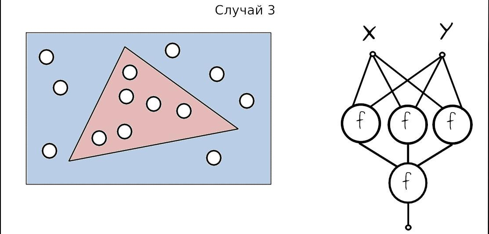

# Тестовое задание по нейронным сетям

На рисунках ниже рассмотрены 3 задачи.  
Требуется отделить интересующее подмножество из $R^2$.  
Во всех случаях необходимо выделить часть $R^2$, помеченную красным цветом.  
Задачу необходимо решить при помощи простой нейронной сети.

В случае 1 необходимо разбить $R^2$ на 2 части и выделить одну из них.

В случае 2 необходимо отделить область $R^2$ ограниченную сектором,
как на рисунке.

В случае 3 необходимо выделить замкнутую область, заданную треугольником.

### Теоретическая часть.

Пожалуйста, объясните, почему в случае 1 необходим 1 нейрон, без скрытых слоёв?  
Почему в случаях 2 и 3 необходимы скрытые слои?  
Почему в случае 3 представлены 3 нейрона?  

### Практическая часть.

Руками подберите веса дле нейронной сети из случая 3.  
Напишите функцию, которая будет подбирать веса для отделения области, ограниченной  
произвольным треугольником. Треугольник передаётся на вход в виде списка координат его вершин.
