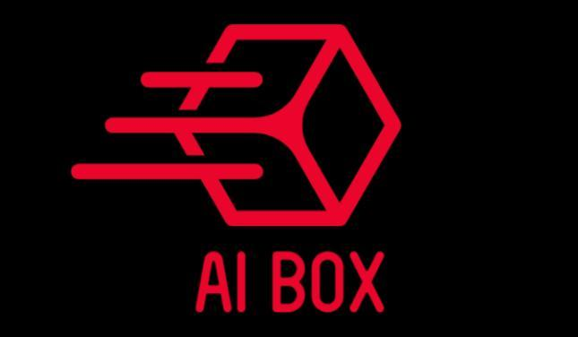

`AiBox Labs` - относительно молодой игрок на рынке.
Мы создаём продукты с применением машинного обучения, глубоких нейронных сетей, статистических алгоритмов и других технологий для различных сфер жисни человека.
Ключевой продукт `AiBox` на данный момент - гибкая система распознавания речи,
которая доказала свою эффективность и конкурентноспособность.

# Вопросы и задачи для новых кандидатов.
Все задачи кроме тестового решаются во время собеседования.
Тестовое задание выдаётся на срок 3 дня.

## Знакомство
- Давайте познакомимся! Расскажите немного о себе. Какими вашими проектами вы гордитесь?
- Какими языками программирования вы владеете. Перечислите в порядке уменьшения
совершенства владения или частоты применения языков.


## Задачи приближенные к нашим текущим, на размышление.
- Как оптимизировать умножение матриц.
Приведите код простейшего алгоритма для выполнения операции умножения матриц.
Какие методы ускорения данного алгоритма вы можете предложить? Почему?
- Как ускорить вычисление нейронных сетей на Андроид.
Есть огранниченная вычислительная система с ОС `Android` на борту.
Тесты на производительность показывают, что узким местом в некоторой программе
является `inference` проход в нейронной сети. Какие методы ускорения вы можете
предложить?  

## Задачи на сообразительность.
- Задача с сложением флотов разных масштабов.
- Задачка раскрашиванием области расчёркнутой случайными линиями. Нужно раскрасить в шахматном порядке.
- задачка со взвешиванием монеток 9 монет.

## Давайте попишем код!
Предлагается написать некоторый код в режиме реального времени в [редакторе](https://codeshare.io/):
- Вопросы по структурам данных:
Список, вектор, бинарное дерево, сортировки, синглтон.
- Реализовать структуру данных двусвязный список с операциями добавления, удаления элементов.
- Реализовать структуру данных

# Тестовое задание
На ваше усмотрение решите одну из предложенных ниже задач.

##### Система визуализации векторов с развёрткой по времени.
Программа принимает на вход текстовый файл вида:
```
0.0000 0.1 0.2 -0.31 -0.07 ... 0.23
0.0200 0.11 0.25 -0.24 0.012 ... 0.27
...
12.100 -0.07 -0.3 0.121 0.05 ... 0.01
```

Первая колонка представляет собой временные метки получения вектора данных.
Векторы данных в текстовом виде располагаются построчно. Размерность вектора - 40.
Программа должна считать файл и отобразить векторы в виде waterfall-диаграммы.
Диаграмма может быть анимированной или статичной. Для решения задачи можете
использовать любые библиотеки. Программа должна быть написана на C++ с применением
стандартов 11/14/17/20. Проект передаётся в виде исходного кода, скриптов сборки.
Операционная система Linux.

##### Нейронная сеть с классификацией и визуализацией.
На `Pytorch` или `Tensorflow` написать небольшой скрипт решающий классификационную задачу.
Датасет для классификации - множество векторов в R2, со значениями 0...5.
Выход нейронной сети - число.
Подаваемые на вход сети векторы - координаты точки на шахматной доске. Нейронная
сеть должна выдать 1 для белых клеток и 0 для чёрных клеток.
Датасет для тренировки сети, а также тестовый датасет необходимо сгенерировать
самостоятельно.
